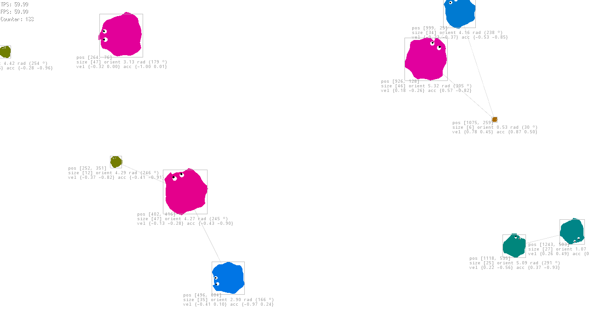

# golife

***WORK IN PROGRESS***

`golife` is a cell evolution simulator.

It presents autonomous organism with inner properties and behavior (hunter or prey) that live (move, eat, grow, reproduce) or die.

## Presentation

`golife` creatures design is inspired from (Otoro's creatures)[https://blog.otoro.net/2015/05/07/creatures-avoiding-planks/].
The main goal is to understand how neural networks and genetic algorithms work with a concrete use case.

## Features

* [x] A cell can move
* [x] When a cell moves, it looses energy
* [x] When a cell's inner energy is too low, it dies
* [x] When a cell touches another cells, the bigger one absorbs the smaller one and its size increases from a given factor depending of the energy of the smaller one.
* [ ] After a given period of time, a cell uses its inner energy to grow
* [ ] A cell can see other cells in a given radius around it
* [ ] Each cell behave like a hunter or a prey
* [ ] A cell can divide into two smaller cells with the same genetic information when it reaches a given size and given energy level
